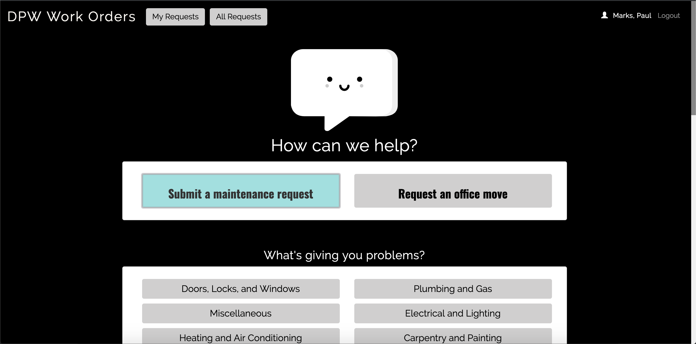

# DPW Work Orders

DPW Work Orders is used by the Department of Public Works at the City of Pittsburgh.  It provides a platform for City employees to request maintenance, construction, or office moves at facilities, parks, or any other City asset.  All requests can be tracked by department, facility, status, or issue type.

DPW Work Orders interfaces with Cartegraph, the work order management system used at the City of Pittsburgh.  All traffic to and from Cartegraph is facilitated by [cart-api](https://github.com/CityofPittsburgh/cart-api).  Email confirmations are delivered with Sendgrid via [sendgrid-proxy](https://github.com/CityofPittsburgh/sendgrid-proxy).



## A note on boilerplate

The bones of DPW Work Orders are shared across all client applications developed by Paul Marks for the City of Pittsburgh.  For more in-depth documentation on the structure,  design choices, authentication flow, and installation procedures for this application, please see the documentation for the [boilerplate](https://github.com/CityofPittsburgh/react-typescript-boilerplate).

This README will focus only on the components of this application that are unique to DPW Work Orders.

## Structure
    ...
    app
    ├── src                         
        ├── components              
            |── newRequest     # Contains all markup and functions involved in generating a new work order
            |── requests       # Existing work orders -- all, and logged in user's
        ├── store                   
            |── allRequests    # Store of all existing work orders
            |── facilities     # Store of all facilites
            |── issues         # Store of all issue types
            |── newRequest     # Global state for new work order generation

## Running Locally

### Prerequisites

* [Node.js](https://nodejs.org) - JS runtime
* .env - See .env.example for all required secrets

### Installation
```
git clone https://github.com/CityofPittsburgh/DPW-work-orders
cd DPW-work-orders
// first, install dependencies for the server
npm install
// then, install dependencies for the client
cd app
npm install
// to run the app locally and bypass auth
npm start
// to bundle the app for deployment
npm run build
// to run the app from the minified build, with auth workflow
cd ..
node server.js
```

## Deployment

Both staging and production services are hosted in Azure.  Application is deployed directly from github, and can be triggered either (a) through the Azure GUI, (b) through the [CLI](https://docs.microsoft.com/en-us/cli/azure/webapp/deployment/source?view=azure-cli-latest#az-webapp-deployment-source-sync), or (c) through the [proxy service](https://github.com/CityofPittsburgh/azure-proxy).

For complete documentation on the azure environment, see [here](https://github.com/CityofPittsburgh/all-things-azure.git).

## License

This project is licensed under the MIT License - see the [LICENSE.md](LICENSE.md) file for details